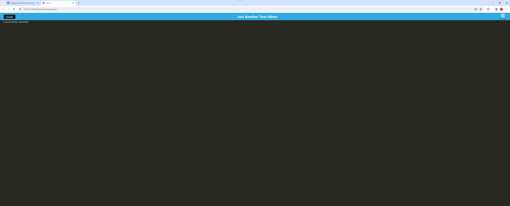

# Text-Editor

Note taking text editor that runs offline in the browser.
https://text-editing-offline.onrender.com

## Navigation
- [User-Story](#user-story)
- [Description](#description)
- [Author](#author)

## User-Story

AS A developer
I WANT to create notes or code snippets with or without an internet connection
SO THAT I can reliably retrieve them for later use

## Description

Created here is a simple to use text editor that has functionality offline as well as online. Data is pulled from the indexedDB to populate the editor. A service worker is utilized to keep data saved in local storage. This application can also be downloaded into an icon for your desktop.

## Author

Gregory Quinn Roth - https://github.com/rothgq